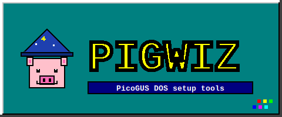

<p align="center">
  
</p>

DOS-side setup tools for the [PicoGUS](https://github.com/polpo/picogus) sound card. PGINST is a TUI wizard that picks a mode (GUS, SB16, SBPro, Tandy, CMS, MPU), nails down ports/IRQ/DMA, writes the right `SET BLASTER=` / `SET ULTRASND=` lines into AUTOEXEC.BAT, and patches CONFIG.SYS. PGSETUP does the same kind of work after install when you want to retune live. PGBUNDLE is a self-extracting bundle that ships everything you need to a DOS box in one EXE.

## What's in it

- **PGINST.EXE** — first-run setup wizard, ~65 KB
- **PGSETUP.EXE** — live settings manager, ~58 KB
- **PGUSINIT.EXE** — PicoGUS init utility, from [polpo/picogus](https://github.com/polpo/picogus)
- **PICOGUS.UF2 / PG-NE2K.UF2** — main + NE2000/WiFi firmware
- **CTMOUSE / SHSUCDX / UIDE / UDVD2** — FreeDOS helper drivers
- **Gravis UltraSound v4.11** + **Pro Patches Lite 1.61** patches, baked in to the full bundle. GUS-mode install extracts to `C:\ULTRASND\` automatically.

## Editions

Every release ships in three flavours.

**SFX bundle** (`PGBUNDLE-vX.Y.Z-pg-vN.M.O.EXE`, ~14 MB). Copy to a DOS box, run it, point at `C:\PICOGUS\`, done. The installer launches from there. This is the easy path.

**Zip distro** (`PIGWIZ-vX.Y.Z-pg-vN.M.O.zip`, ~13 MB). Same payload as the SFX but as a plain zip if you'd rather expand it yourself.

**Floppy edition** (`PIGWIZ-floppy-vX.Y.Z-pg-vN.M.O.IMG`, exactly 1.44 MB). A FAT12 disk image that fits on a real 1.44 MB floppy. Setup wizard + firmware + helper drivers + small GUS driver configs. Drops the 11 MB of `.PAT` audio samples because they can't lossless-compress below ~9 MB and LZMA on 16-bit DOS is impractical (256 KB minimum dictionary, 640 KB conventional memory). For non-GUS modes the floppy is fully functional. For GUS mode it sets up the env vars, creates `C:\ULTRASND\`, drops `ULTRASND.PPL` and `ULTRASND.INI` in place, and leaves `MIDI\` empty for you to populate from elsewhere.

## Install

### From the SFX bundle

Download `PGBUNDLE-*.EXE` from the [releases page](https://github.com/pacnpal/PIGWIZ/releases). On the DOS box:

```
A:\> PGBUNDLE.EXE
```

It prompts for an extract path (defaults to `C:\PICOGUS\`), drops everything there, then `cd C:\PICOGUS` and `PGINST.EXE` does the rest.

### From a floppy

```
dd if=PIGWIZ-floppy-v0.0.1-pg-v4.0.0.IMG of=/dev/fd0 bs=512   # Linux
```

Or write with Rawrite/Rufus on Windows, or `imgmount a IMG -t floppy` in DOSBox. On the DOS prompt:

```
A:\> INSTALL
```

INSTALL.BAT extracts the firmware, copies the EXEs to `C:\PICOGUS\`, then launches PGINST.

## Build from source

The DOS EXEs are built with Open Watcom v2 (16-bit DOS, large memory model). The bundling is bash + standard archive tools.

```
./build.sh    # compile PGINST.EXE, PGSETUP.EXE, PGBUNDLE.EXE
./bundle.sh   # assemble zip, SFX bundle, and floppy image
```

`bundle.sh` pulls the latest PicoGUS firmware from upstream, the helper drivers from ibiblio's FreeDOS mirror, the GUS patches from archive.org's mirror (skip with `GUS_PATCHES_URL=` to build patch-less), and the DOS Info-ZIP UnZip + CWSDPMI. Outputs land in `outputs/`.

CI uses the `pangbox/openwatcom-action` container for the compile step and ubuntu-latest for bundling. See `.github/workflows/build.yml`.

## Hacking on it

- `pginst.c` — the install wizard, ~1200 lines of plain C with a hand-rolled TUI (`tui.c` / `tui.h`)
- `pgsetup.c` — settings manager, shares `tui.c`
- `pgbundle.c` — SFX stub that reads its own appended payload via a 12-byte trailer (`PGZ1` + dir offset + file count)
- `pack-bundle.py` — append-payload step that wraps `pgbundle.exe` with a file directory + raw file data

Run `./demo-pginst.sh`, `./demo-pgsetup.sh`, or `./demo-pgbundle.sh` to launch each in DOSBox-staging against a temp drive.

## Credits

- **PicoGUS hardware + firmware** — [polpo/picogus](https://github.com/polpo/picogus)
- **Gravis UltraSound v4.11 driver** — Advanced Gravis Computer Technology (1995, abandonware)
- **Pro Patches Lite 1.61 + anti-loop fix** — Tom Klok et al, community-maintained
- **Info-ZIP UnZip for DOS** — Info-ZIP project
- **CWSDPMI** — DJ Delorie
- **CuteMouse** — Nagy Daniel
- **SHSUCDX** — Jason Hood / Eric Auer
- **UIDE / UDVD2** — Jack Ellis
- **Open Watcom v2** — for letting us still build 16-bit DOS EXEs in 2026

## License

PIGWIZ source itself: see `LICENSE`. Bundled third-party binaries keep their own licences, summarised in `PIGWIZ.TXT` inside the bundle.
